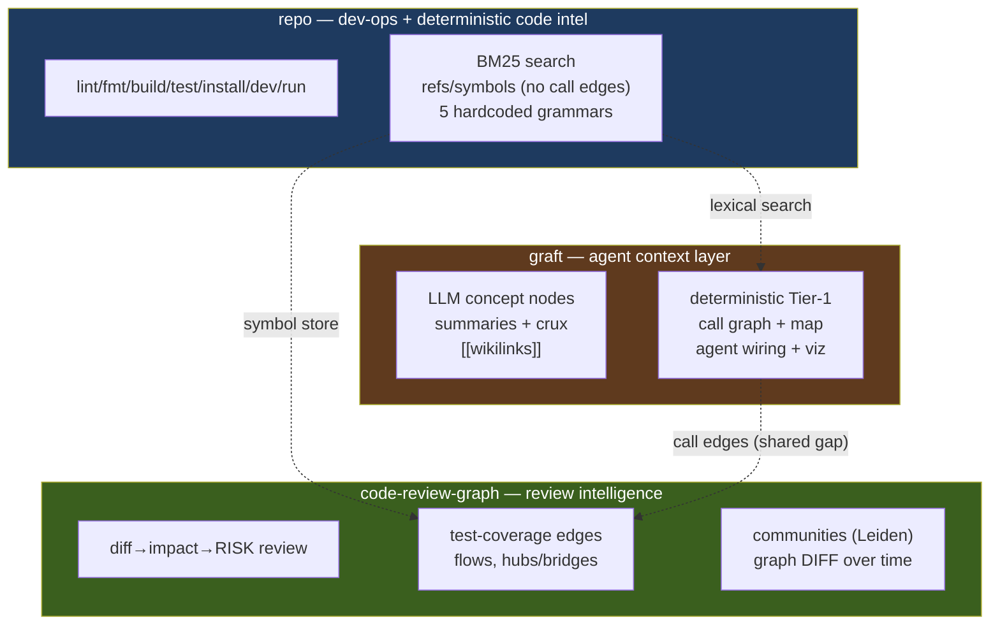
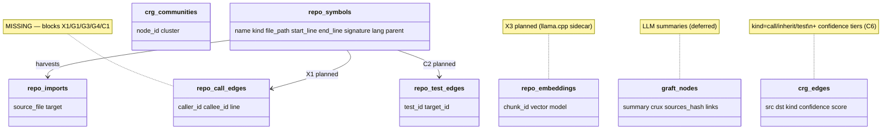
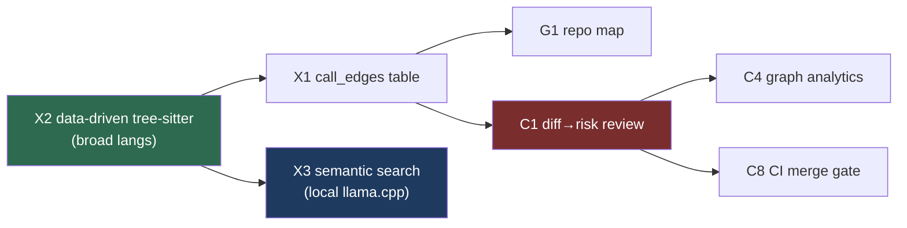

# Feature Gap Analysis — Graft & code-review-graph vs `repo`

> References:
> - **Graft** — <https://github.com/NanoNets/Graft> (README captured 2026-08-07)
> - **code-review-graph (CRG)** — <https://github.com/tirth8205/code-review-graph> (README captured 2026-08-07)
> - **minni** (reference impl we partly ported) — <https://codeberg.org/drangus/minni>
> - `repo` source of truth: `src/` + `CONTEXT.md`

## 1. What each tool actually is

Three tools, three centers of gravity. The overlaps are real but partial.

| Dimension | **Graft** | **code-review-graph** | **`repo`** |
|---|---|---|---|
| Core thesis | AI context layer — *semantic* explanation graph so agents stop re-exploring | **Local-first review-intelligence graph** — "what does my diff break" | Universal dev-ops CLI + deterministic code intel |
| Killer use | Don't re-explore | **Diff → impact → risk review** | lint/build/test + refs |
| Graph theory | map (dir clusters + in-degree) | **communities, betweenness, surprise, flows** | none (defs + import edges only) |
| LLM/embeddings | summaries (provider key) | optional embeddings (sentence-transformers/Gemini/OpenAI/Voyage) | none |
| Languages | tree-sitter, broad | **40+** + data-driven `languages.toml` | 5 hardcoded grammars |
| Persistence | `graft/*.md` (committed) + `wiring.json` | SQLite in `.code-review-graph/` (gitignored) | Tantivy index + SQLite symbol store (gitignored) |
| Dev-ops commands | none | none | `lint` `fmt` `build` `test` `install` `dev` `run` `mix` |
| Search | in-edge-coupled ranking, grouped by symbol | FTS5 + optional vector (MRR 0.35, self-admittedly weak) | BM25 over 64-line chunks |
| MCP | yes (6 tools) | **yes (30 tools)** | none |



The actionable overlaps: **call edges** are wanted by all three; **search** and **symbol store** are where we already compete; CRG's **diff-driven risk review** is unique to it.

## 2. Parity — what `repo` already covers

| Their command | `repo` equivalent | Status |
|---|---|---|
| `graft build` / `crg build` (no LLM) | `repo symbols` | Equivalent intent — deterministic tree-sitter symbol extraction |
| `graft callers` / `crg query_graph` | `repo refs <symbol>` | Overlaps — defs + importers + references. **No call edges** (gap) |
| `graft ask` / `crg semantic_search` | `repo search` (BM25) | Different ranking; no semantic layer yet (planned) |
| `graft grep` | `repo search` + `repo refs` | Partial — not grouped by symbol (gap G3) |
| `crg detect_changes` (risk review) | (none) | **Gap C1** — CRG's moat |
| `crg get_hub/bridge_nodes` | (none) | Gap C4 — graph analytics |
| (none) | `repo lint/fmt/build/test/install/dev/run` | **Both Graft & CRG lack dev-ops** — our moat |
| (none) | `repo context` / `repo mix` | **Both lack one-shot context + repomix** |
| `crg serve` / `graft mcp` | (none) | Gap G8 — MCP server |
| `crg visualize` / `graft viz` | (none) | Gap G12 — graph viewer |

### What `repo refs` already does well (`src/commands/refs.rs`)
- Definitions incl. `impl` blocks, rendered hierarchically (type → impl → methods)
- Methods via `symbols::children` (parent containment)
- Importers from the persisted import-edge store
- On-demand references via tree-sitter, **skipping comment/string subtrees** (precision win over regex)
- `repo refs` (no arg) emits a repo-wide ctags-style outline

## 3. Gap catalog

Gaps prefixed **G** = surfaced by Graft, **C** = surfaced by CRG, **X** = shared/cross-cutting. Tiers by fit with `repo`'s ethos.

### Tier A — Deterministic, foundational, high leverage

#### X1. `call_edges` table + blast-radius walk (Graft G2 / CRG core)
**Them:** Graft `callers --direction out --depth N`; CRG's entire graph is built on call edges. Both answer "what breaks if I change X."
**`repo`:** `refs` reports defs + importers + textual refs. **No call edges in the schema at all** (`src/symbols/schema.sql`). Cannot do transitive blast radius.
**Delta:** harvest caller→callee during parse; BFS/DFS for transitive walks. Unlocks `map`, symbol-grouped grep, diff/risk review, analytics.
```sql
CREATE TABLE call_edges (
  caller_id INTEGER REFERENCES symbols(id),
  callee_id INTEGER REFERENCES symbols(id),
  line INTEGER
);
```
**Effort:** M. **Leverage:** H — the foundational data structure for Graft's, CRG's, *and* our next phase.

#### X2. Data-driven tree-sitter (broad language support) — CRG `languages.toml`
**CRG:** add a language by mapping `extensions → grammar + {function/class/import/call node-types}` in config. **40+ languages**, no fork, no per-language code.
**`repo`:** language definitions are **hardcoded** Rust match-arms (`src/symbols/parse.rs:86 def_kind`, `lang.rs`). Detection is already data-driven (YAML+CEL); only parsing is hardcoded. 5 grammars only.
**Delta:** move node-type tables into config (extend `defaults.yaml` or a `languages.toml`); generic walker extracts symbols. Mechanism for grammar availability to be decided (dynamic `.so` load vs. broad static linking) — see PLAN.md Pillar 1.
**Effort:** M–L. **Leverage:** H — unblocks both better semantic indexing (symbol-aware chunks) *and* call-edge extraction across all languages.

#### G1. `repo map` — repo orientation (Graft `graft map` / CRG `architecture_overview`)
Directory clusters + per-dir hubs + global hotspots, ranked by in-edge degree. We store symbols + (soon) edges; in-degree is a `GROUP BY` count. **Effort:** S–M. **Leverage:** H.

#### C1. Diff → impact → risk review (CRG `detect_changes`) — CRG's moat
Map a `git diff` to affected functions + execution flows + **test gaps**, emit a **risk score**. Neither Graft nor `repo` does diff-driven review. Builds directly on X1 (call edges).
**Effort:** M–L. **Leverage:** H — the single most defensible "why a code graph exists" story.

#### G5/G6. Freshness drift check + per-file skeleton
`repo check` (drift report, non-zero exit for CI) + `repo skeleton <file>` (signatures, no bodies). Both reuse existing parses. **Effort:** S each. **Leverage:** M.

### Tier B — Deterministic analytics & new surface (CRG-heavy)

#### C2. Test-coverage edges + untested hotspots (CRG `get_knowledge_gaps`)
Link test→tested-function; flag untested high-coupling nodes. We track nothing about test↔code. Needs `test_edges` table. **Effort:** M. **Leverage:** M–H.

#### C3. Execution flows from entry points (CRG `list_flows`)
Detect entry points (framework/conventional), trace call chains, rank by criticality. Needs X1 + entry-point heuristics. **Effort:** M. **Leverage:** M.

#### C4. Graph analytics — hubs / bridges / surprise (CRG)
Hubs (in-degree), bridges (betweenness centrality), surprise (unexpected cross-community coupling). Real graph theory, a step beyond Graft's in-degree "map." Betweenness needs a small algorithm (no dep); communities (Leiden) needs an optional dep. **Effort:** M. **Leverage:** M.

#### C5. Graph diff over time (CRG)
Compare graph snapshots — new/removed nodes/edges, community drift. "Architectural regression" use case. Nobody does this. Needs versioned snapshots. **Effort:** M. **Leverage:** M.

#### C6. Edge confidence tiers (CRG)
`EXTRACTED` / `INFERRED` / `AMBIGUOUS` provenance on edges. Matters the moment we add call edges (X1) — trust requires provenance, especially for inferred type-aware edges. **Effort:** S (tag at harvest). **Leverage:** M.

#### G3. Search grouped by enclosing symbol (Graft `graft grep`)
Exhaustive regex hits grouped by enclosing symbol, ranked by coupling. Needs X1 + enclosing-symbol logic (already in `refs` rendering). **Effort:** S–M. **Leverage:** M–H.

#### G4. Method-call resolution through receiver type
Resolve `self.router.get()` → `APIRouter.get` via constructor assignments + annotations. Two sub-gaps: no call edges (X1) + no type binding (per-function type inference). **Effort:** L. **Leverage:** H for method-heavy repos, M otherwise.

#### G8. MCP server (Graft 6 tools / CRG 30 tools) — DONE (2026-08-20)
`repo mcp` exposes `context`/`search`/`refs`/`task` over stdio (rmcp 3). Kept
to 4 tools: refs subsumes symbols (store auto-builds), search subsumes index,
`task(kind)` subsumes lint/fmt/build/test. Not exposed: `run` (live-streaming,
hangs request/response), `mix` (repomix shell-out). See CONTEXT.md "MCP server".

### Tier C — Needs a model (decided: externalize to local llama.cpp)

#### X3. Semantic search — dense + reranker (minni Stage 2/3, CRG embeddings)
Our `repo search` is BM25-only; it fails on conceptual queries (`"how does authentication work"` → noise). **Decision: implement 3-stage hybrid (BM25 ∪ dense → cross-encoder rerank), externalizing inference to a local llama.cpp server. BM25-only when unconfigured; hard-fail if configured but server down.** See PLAN.md Pillar 2.

#### G9/X4. Monorepo / multi-repo scoping
Graft `--in <scope>`; CRG multi-repo registry + daemon. We `chdir` to a single `.git`. **Effort:** M. **Leverage:** M.

### Tier D — Out of ethos (product decisions, not gaps)

- **G10 / C-wiki** LLM concept nodes / wiki generation — conflicts with zero-LLM default (we've chosen semantic *search*, not LLM *summaries*).
- **G11** Agent wiring (`graft init`) — we already ship `skills/repo-cli/`; deterministic, lower priority.
- **G12** Interactive viz (CRG D3 / Graft viewer) — could emit static mermaid/SVG far more cheaply.
- **C8** GitHub Action + `fail-on-risk` merge gate — CI-native; feasible once C1 lands.
- **C9** Hooks + daemon + multi-repo watch — operational; defer.

## 4. Data model comparison



`repo` today: `symbols`, `imports`, `tracked_files`, `meta`. The **call_edges** table is the single schema change that unlocks the most Tier-A gaps across *both* competitors. `embeddings` is the search-tier addition (Pillar 2).

## 5. Recommended roadmap (decided direction)

Three pillars, sequenced. Detail in **PLAN.md**.



1. **Pillar 1 — Data-driven tree-sitter (X2).** Foundational: broad language support for both semantic indexing and CRG features.
2. **Pillar 2 — Semantic search via local llama.cpp (X3).** 3-stage hybrid; BM25-only default; fail-loud if configured-but-down.
3. **Pillar 3 — CRG integration.** `call_edges` (X1) → blast radius → `repo map` (G1) → diff/risk review (C1) → analytics (C4) → CI gate (C8).

**Deferred until deliberate product call:** LLM summaries (G10), viz (G12), hooks/daemon (C9).

## 6. Our moat (strengths to keep)

- **Full dev-ops lifecycle** — `lint`/`fmt`/`build`/`test`/`install`/`dev`/`run`, data-driven via YAML+CEL, multi-language. Neither competitor has this.
- **Zero-LLM default** — runs anywhere, air-gapped, `$0`. Semantic is opt-in via a local llama.cpp the user controls (no cloud key, no bundled model weights).
- **`repo context`** — one-shot AI-ready context with parallel gatherers (git/metadata/rules/graph/todos/tests/readme/structure/tree + opt-in stats/analysis/audit).
- **`repo mix`** — repomix packing into a single AI-friendly file.
- **Cost-tiered command gating** (`--cost N`) — CI-friendly, skip-expensive-by-default.

## 7. Where competitors are weak (our wedge)

- **CRG search MRR 0.35** — "ranking needs improvement." Our BM25 + identifier expansion is already competitive lexically; semantic will leapfrog.
- **CRG impact "recall 1.0" is circular** — ground truth derived from the same graph; real avg precision **0.55** (deliberately over-predictive). A more precise blast-radius is a real differentiator.
- **CRG flow detection 33% recall**; co-change mode broken.
- **CRG heavy optional deps** (embeddings/igraph/jedi/tiktoken). We externalize the model to llama.cpp and stay a single lean binary + one small HTTP client.
